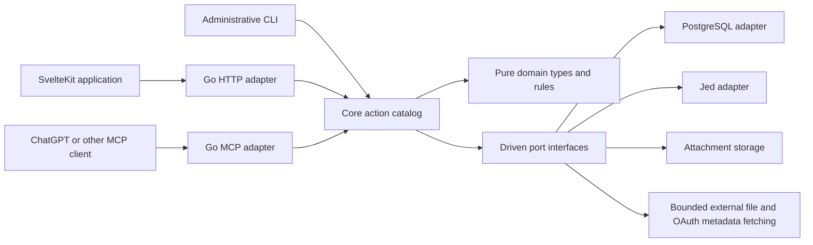

# Money Bags design

Status: implementation contract. See [implementation decisions](../decisions/2026-09-26-implementation.md)
and the repository README for the implemented application and verification.
Date: 2026-09-26.

## 1. Purpose and scope

Money Bags answers one question: **How much money do I have left in this bag?**

A bag is a named spending envelope shared by a family. A user adds money to
the bag and records expenses against it. The balance is the money added less
the money spent. For example:

| Activity in Groceries | Change | Remaining |
| --- | ---: | ---: |
| Create the bag | — | $0.00 |
| Add money | +$1,000.00 | $1,000.00 |
| Record a grocery trip | −$87.32 | $912.68 |
| Another family member records a trip | −$42.50 | $870.18 |

The web application makes these actions quick on a phone. MCP exposes the same
functionality so someone can manage their bags through ChatGPT or another
assistant, returning to the website mainly for initial login, connection
authorization, or account management.

### Required capabilities

- Create bags, credit money, record expenses, and see current balances.
- Give each person their own login and equal access to all shared data and
  family-management actions. There are no user roles.
- Each user account belongs to exactly one family. There is no separate
  leave-family or family-switching workflow; removing a user deletes that account.
- Support passkey login.
- Store all monetary amounts as signed `bigint` cents. Money is always USD;
  there is no stored currency field or currency setting.
- Use one entry model for credits and debits/purchases. Every entry supports
  optional multiline Markdown notes and any number of file attachments.
- Allow zero-dollar entries for chronological notes, and allow entries to be
  deleted normally.
- Each entry affects exactly one bag. When a physical receipt covers several
  bags, record separate entries with their own amounts; notes and attachments
  may be duplicated across those entries. Extracted details can be a Markdown
  table in the notes, without a receipt entity or receipt-total reconciliation.
- Make the complete bag, entry, attachment, and family-management workflows
  available through MCP as well as the web application.
- Use Go, SvelteKit, mise, a central core action catalog, and interchangeable
  PostgreSQL and Jed persistence implementations, following Logger4Life and FAM.

### Proposed first-version boundaries

These are design recommendations, rather than requirements supplied by the
project brief. They keep the first version small and are collected again in
section 12 for review.

- An individual uses a family of one.
- All family members see and can manage every bag; there are no private bags
  or invitations to individual bags.
- Balances accumulate until changed by entries. There is no monthly reset,
  rollover job, recurring funding schedule, or budget-period model.
- Transferring balances between bags remains a later feature.
- This version tracks allocated spending money. Bank accounts, bank connections,
  statement imports, reconciliation, double-entry accounting, debt, investments,
  tags, tax allocation, and forecasting are outside its scope.
- Receipt details are written into notes by the user's assistant or by hand. The
  Money Bags server does not require an AI provider, model, or API key.

## 2. Product behavior

### Bags and entries

A bag has a name, an optional description, and an archived flag. Names must be
nonblank and unique within the family after trimming and case normalization.
Archived bags retain their names and history; unarchive a bag to reuse it.
Active and archived bags may also be permanently deleted after confirmation.
Deletion removes the bag, its entries, revisions, attachments, consumed uploads,
and all family members’ pins for that bag. Other bags remain unchanged. Request
keys remain as tombstones so retries cannot recreate deleted data.

Credits and debits use the same **entry** model and table. An entry contains
exactly one bag ID and one signed amount, along with its date, optional multiline
Markdown notes, author, and attachments. A positive amount credits the bag;
a negative amount records spending. There is no separate purchase table or
stored entry-type field. Zero is also a valid amount for a chronological note.
A new bag starts at zero; an explicitly supplied initial amount creates a normal
entry in the same action transaction as bag creation.

```text
bag balance = sum(amount_cents for all entries in that bag)
```

For example, a $75 physical receipt can lead to two independent entries:
−5,000 cents in Groceries and −2,500 cents in Household. Both entries may include
the full receipt image and the same or similar notes. Each entry stores its own
notes and attachments, which can be edited or removed independently.

There is no parent purchase, receipt group, allocation table, or relationship
between these entries. Money Bags does not reconcile their combined amounts
against the receipt. Notes may include the full receipt or only some details;
those details need not add up to an entry's amount. Credits allocated to
different bags are also separate entries.

An amount of zero is valid. It creates a dated entry with notes and optional
attachments, appears in the bag's chronological activity, and leaves the balance
unchanged. No special note-entry type is needed. All interfaces must distinguish
an explicitly supplied `0` from a missing amount; an amount is still required.
Notes remain optional, even for a zero-dollar entry.

Entry dates describe when the activity happened; timestamps describe when it
was recorded. Backdated entries affect the current balance. Future-dated entries
are rejected in v1 rather than becoming scheduled spending. A missing date
defaults to today in the family's configured time zone. Merchant names and
other context can be written in the notes without additional structured fields.

Negative balances are allowed and displayed plainly. Spending already happened
even if it exceeded the bag's allocation. Neither client nor server refuses to
record that spending because the balance is insufficient.

An archived bag remains readable and keeps its balance. Creating or editing an
entry requires its bag to be active; unarchive the bag first. Existing entries
can be deleted even while the bag is archived.
Archiving does not discard unspent money. The home screen shows active bags and
makes archived bags accessible separately; any aggregate is labeled with which
bags it includes.

A refund is a positive entry in the appropriate bag, with its explanation in
the notes. A mistaken entry can be edited or deleted. Deletion removes the
entry and its contribution to the bag balance. There is no void status,
soft-deleted entry, or restoration workflow.

### Shared use and identity

Follow FAM's family tenant boundary. Registration creates a family and its first
user. A single-use, expiring invitation link lets another person create their
own account inside that family. The inviter shares the link; outbound email is
not required. An account already belonging to another family cannot move or
join through this flow in v1.

Every active family user has the same access. Anyone can manage bags, entries,
notes, attachments, invitations, family settings, and access for other users in
the family. This includes editing or deleting entries recorded by someone else.
Registration and invitation acceptance confer the same permissions. No role
column, ownership transfer, or privileged first user is needed, following FAM's
equal-access family model. Personal credentials and connected-client grants
remain managed by the person they authenticate.

An account belongs to its family for its entire lifetime. Removing a user,
including yourself, is account deletion, not a change of family membership.
Use one `delete_user` action and label it **Delete account** in the UI; there
is no `leave_family` action or account that remains usable outside a family.
Deletion removes the login account and credentials and revokes its sessions and
MCP grants. Existing family entries and attachments remain, with historical
authorship preserved independently of the deleted login account. Authentication
checks that the account still exists so an old token cannot retain access.

Keep the sibling projects' password login and passkey support as the initial
authentication approach. Allow multiple passkeys, enrollment from an
authenticated session, and passkey login. Password login provides an alternate
way back in if a passkey is unavailable. Password changes and passkey removal
require recent authentication. Do not imply email-based
recovery exists before it is implemented.

### Minimal web experience

The main screen is a compact list of bag names and remaining amounts, with
**New bag**, **Add money**, and **Record expense** as the principal actions.
A bag page shows its balance and reverse-chronological activity. An expense
form needs only a bag and amount; date defaults to today. **Add money** and
**Record expense** use the same entry form with the appropriate sign applied
to the entered amount. Record a second entry when another bag should bear part
of the spending. Either form accepts `$0.00` for a chronological note; zero
entries appear alongside other activity. The notes control is a textarea with
Markdown support, and an attachment picker allows multiple files. Both are available on credit entries
as well as spending entries.

An entry detail page shows its bag, amount, rendered notes, attachment list,
edits, deletion, and change history. Each activity row corresponds to one entry
in that bag.
Account settings contain passkeys and connected MCP clients; family settings
contain members and invitations. These management screens stay out of the
ordinary recording flow. Use accessible forms, keyboard navigation, and text
labels for negative balances instead of relying only on color.

## 3. Entry notes and attachments

Every entry has an optional `notes` text field and zero or more file
attachments. There is no receipt record, receipt-line table, receipt total,
itemization state, or item-to-bag mapping. Receipt images and scans are ordinary
attachments on the entry, just like any other supporting file.

Notes are freeform Markdown entered in a textarea. They can explain a credit,
describe a purchase or refund, or hold details extracted by an assistant. For
example, the Groceries entry from the $75 receipt could contain:

```markdown
Groceries portion of Saturday shopping. Full receipt attached.

Some items from the receipt:

| Item | Printed amount |
| --- | ---: |
| Coffee | $12.00 |
| Dish soap | $6.50 |
```

The table is text for people to read. Money Bags does not parse it into
financial records, require that it is complete, check its arithmetic, allocate
tax, or assign its rows to bags. Only each entry's signed amount affects its
bag's balance. Editing notes or adding files has no monetary effect. Another
entry can contain a copy of this table and the same receipt image.

Store the Markdown source and render it safely, with raw HTML disabled or
sanitized and unsafe links rejected. An assistant can write extracted details
directly into `notes`; the same text remains editable by the user. Notes and
file contents are data and cannot authorize unrelated tool calls.

A clear request to record spending can commit directly; there is no mandatory
website review queue. The assistant resolves an unclear amount or bag
before recording. It can preserve incomplete or uncertain receipt details in
the notes without a reconciliation workflow. Supporting files are optional for
both credits and debits, and an entry may have any number of them. Storage
quotas and per-file/request byte limits are operational bounds, not a fixed
attachment-count limit in the entry model.

### Attachment storage and lifecycle

Adopt FAM's `BlobStore` boundary, initially backed by a local filesystem
directory. Relational records hold attachment metadata; bytes live behind
`PutBlob`, `GetBlob`, and `DeleteBlob`. Blob storage is independent of which
database backend is selected. An object-store implementation can be added later
without changing the product model.

Each attachment is a separate row belonging to an entry, with its own ID,
filename, MIME metadata, byte length, and content hash. Core generates opaque
family-scoped blob keys containing an attachment ID. Never accept a filesystem
path or storage key from the client. Store files as opaque bytes; image and PDF
previews are conveniences, not a restriction to receipt files.

Attaching the same receipt to another entry creates another attachment record
and blob copy. Identical content is allowed. Each copy has an independent
lifetime, so deleting one entry's attachment cannot remove another entry's
file. Content hashes are not unique constraints or evidence of duplicate
spending; physical storage deduplication is unnecessary in v1.

Initially cap each file at 5 MiB, following FAM. Enforce the cap while receiving
or fetching bytes, detect content type where possible, and bound image
dimensions if decoding previews. MIME labels and filenames are untrusted.
Store the detected MIME type. Reject a declared JPEG, PNG, GIF, WebP, or PDF
whose bytes lack the corresponding signature, with instructions to resend the
original file bytes. This signature check does not validate full file integrity.
Serve unrecognized or active content as downloads, not executable inline
content. Authenticated reads check the owning entry's family; the blob directory
is never a public static directory. List attachment metadata separately from
bytes and paginate when needed.

Write a new blob under a fresh key before committing the metadata that refers
to it. A failed database transaction may leave an unreachable blob, which a
cleanup action can remove after a grace period. Delete replaced or detached
blobs only after the outer database transaction commits. Ordinary attachment
reads never expose orphaned blobs. A retry must reuse the logical request,
without accidentally creating another financial entry.

An explicit removal names one attachment ID and leaves the other files alone.
Replace a file by adding a new attachment and removing the old one in an entry
update. Deleting an entry removes its notes, revisions, and attachment records
in the database transaction and deletes its blobs after commit. Copies on other
entries are unaffected. For an existing entry, revisions retain metadata, not
historical blob bytes; removal can make an older attachment unavailable. State
this in history rather than implying every old file is recoverable.

File bytes and external download URLs are omitted from list responses,
audit logs, and ordinary entry results. Get the attachment through a dedicated
authorized action. Backups include both database state and the blob directory.

## 4. Architecture and boundaries

Retain the architecture already used by the neighboring projects:



**`backend/domain`** owns pure types, signed money arithmetic, entry
validation, and other pure rules. It performs no I/O.

**`backend/core`** is the complete catalog of application actions, including
reads, writes, authentication, OAuth, attachment retrieval, and administrative
cleanup. Typed parameter and result structs define each action. In-process
callers use `Action.Call`; dynamic adapters use `Core.InvokeJSON`; both run the
same validation, authorization, and middleware. Actions are private by default
and explicitly declare public access, mutation, required permission, transport
exposure, and payload limits.

Core owns orchestration and transaction boundaries and depends on interfaces
such as `BagStore`, `EntryStore`, `AttachmentStore`, `UserStore`, `InvitationStore`,
`SessionStore`, `PasskeyStore`, `OAuthStore`, `AuditStore`, `IdempotencyStore`,
`BlobStore`, `FileFetcher`, `OAuthClientResolver`, and `Transactor`. Inject a
clock and ID/token generation so tests and database comparison use identical
values. Core cannot import persistence or HTTP implementation packages.

**Adapters** translate protocols and execute effects behind these ports.
HTTP handlers handle routing, JSON/multipart parsing, cookies, and status codes.
MCP handlers describe tools and translate their inputs and results. Neither
adapter calculates balances, decides family authorization, executes SQL, or
fetches file URLs directly. Even background and CLI operations enter core
before touching application state. Liveness probes and static process settings
are infrastructure exceptions.

**The composition root** selects the database backend, creates the stores and
one core instance, and gives that core to all adapters. Use Go with Chi, the
Go WebAuthn library, pgx, and the official MCP Go SDK, as in the siblings.
Serve a SvelteKit/Svelte application built with the static adapter; no production
Node server is needed. Use the sibling projects' styling conventions and Vite
development proxy rather than introducing a second backend in SvelteKit.

Suggested repository shape:

```text
backend/
  domain/          # pure rules and values
  core/            # actions and driven ports
  server/          # HTTP, MCP, and composition
  pgstore/         # PostgreSQL ports
  jedstore/        # Jed ports
  dualstore/       # optional comparison harness
  fsblob/          # filesystem BlobStore
  storetest/       # shared persistence contract tests
db/migrations/
  postgresql/
  jed/global/
  jed/family/
src/               # SvelteKit routes and components
scripts/           # finite development/build tasks
deploy/            # Caddy routing template packaged in release archives
spec/design/       # product and technical specifications
spec/decisions/    # subsequent architectural decision records
mise.toml
process-compose.yaml
```

## 5. Data and consistency

### Logical records

This is a logical schema; adapter migrations choose SQL types and physical
layout. IDs are generated in core. Every family-owned record carries
`family_id`, even when stored in a dedicated Jed family file.

| Record | Principal fields and constraints |
| --- | --- |
| Family | ID, name, IANA time zone, version, timestamps |
| User | ID, fixed family ID, username/display name; equal family permissions, credentials kept out of serializable user results; removal deletes the login account |
| Bag | ID, family ID, name and normalized name, description, archived flag, version, timestamps |
| Entry (`entries`) | ID, family ID, exactly one `bag_id`, signed `amount_cents bigint` including zero, entry date, `notes text`, historical author attribution, version, timestamps; the same table holds credits, debits, and zero-dollar notes |
| Attachment (`attachments`) | ID, family ID, entry ID, opaque blob key, filename, detected MIME, byte length, content hash, creation time; many attachments per entry |
| Staged upload | ID, family ID, actor ID, blob metadata, expiry, consumed entry/attachment IDs; linking consumes it once |
| Entry revision | Entry ID and version, actor, time, source, previous/new snapshot of amount, notes, and attachment metadata; no bytes or secrets |
| Invitation | Family ID, inviter, token hash, expiry, accepted/revoked state and accepting user |
| Idempotency record | Family, actor, action, request key, canonical request hash, committed result and creation time |
| Audit event | Family, actor, action, affected IDs, source (`web`, `mcp`, `cli`), time, request ID; redacted metadata |

The same entry table records both directions of money movement. Its `bag_id`
and `amount_cents` describe its complete financial effect. There is no separate
bag-amount table or stored purchase/receipt total. Entries based on the same
physical receipt are independent rows and may duplicate notes and attachments.

Account deletion must not cascade to family entries, revisions, or audit events.
Preserve their author attribution as historical data rather than requiring a
live login-account row. A historical author reference confers no access.

Sessions, passkeys, one-time challenges, OAuth codes, token hashes, grants,
rotation state, and any global routing projections follow the authentication
ports and existing sibling implementations. Their physical location differs
between backends and does not leak into action contracts.

### Money, dates, and ordering

Money is always USD. Store signed cents as SQL `bigint` in both databases and
use `int64` in Go. There are no currency columns, currency settings, or currency
fields in action inputs/outputs. The UI formats cents as dollars, and tool
schemas explicitly describe amounts as USD cents.

Never use floats for amounts or balances. JSON inputs/outputs use integer cent
values restricted to the JavaScript safe integer range, including entry amounts
and aggregate balances; reject overflow instead of rounding or wrapping. Parse
human decimal amounts exactly at the input boundary. For example, spending
$42.50 is stored and passed to core as `amount_cents: -4250`.

Store entry dates separately from UTC timestamps. Generate timestamps in core
at a common precision supported by both stores. Use deterministic ordering with
an ID tie-breaker. Paginated history defaults to `(entry_date DESC, created_at
DESC, id DESC)`; bag lists use normalized name and ID. Apply date and bag filters
in the store, with bounded page sizes.

### Balance, edits, and simultaneous use

The source of truth is the signed amount on each entry that exists.
Compute balances with an aggregate query, including grouped aggregates for the
bag list. Do not maintain a second editable balance column in v1. Aggregate
directly over entries by `bag_id`; joining attachments must not multiply an
entry's contribution.

Creation of an entry, its attachment links, its initial revision, audit event,
and idempotency result is one database transaction.
Editing an entry records another revision in that same transaction. Deletion
removes the entry, its revisions, and attachment metadata atomically and records
a small audit event with the actor and deleted entry ID, without its notes or files.
Amount, notes, and attachment-list changes all use the owning entry's version,
so concurrent changes cannot silently overwrite each other. The bag is fixed
for an entry in v1; correct a wrong bag by deleting the entry and recording a new
one. Notes and files never supply implicit amount changes. Deletion removes
only this entry's contribution; other entries from the same receipt are
unaffected. Recording several entries from a receipt uses separate transactions,
and a failure on one does not roll back another that already succeeded.

Every edit, archive change, and deletion uses an `expected_version` check. Return a
conflict with current state when it is stale. Lock the entry when editing it,
then lock its bag through a store operation. Creation locks its target bag.
PostgreSQL can lock rows; Jed's family write transaction provides serialization.
This coordinates archiving with writes and protects aggregate amount bounds.
The bag must belong to the authenticated family; creation and edits also require
it to be active. Related tenant references use composite constraints or
equivalent store validation, so an
entry or attachment cannot point into another family.

An action returns its bag's balance, calculated inside its transaction after
its writes, with a calculation timestamp. Later activity may change that
balance. Multi-query reads that promise a coherent bag/detail view use one
consistent read transaction. Audit failures roll back the mutation;
do not log success after a financial write has committed independently.

### Retries and duplicate spending

All bag, entry, and attachment mutations accept a required client-generated
`request_id`. Authentication and account lifecycle actions have their own single-use
token and concurrency contracts. The web client creates it once per submission;
MCP tool descriptions require reusing it for retries. Scope the unique key to
family, actor, and action. The canonical request hash includes the bag ID, amount,
notes, and stable attachment identities, excludes temporary download URLs, and
preserves omitted time-dependent defaults. Resolve values such as today's date
only on the first execution and persist them with
the result, so retrying after midnight does not change the request's meaning.

The first successful invocation stores its response in the same transaction as
the mutation. Repeating the same key and payload returns that response without
another write or audit event. Reusing a key with different input is a conflict.
Concurrent uses of a key serialize through database uniqueness/locking. Retain
request-key records in v1 even when an entry is deleted, so an old create retry
cannot recreate it. Deletion clears cached entry content from prior results;
later retries report that the request was applied and the entry has since been
deleted. Retrying the deletion itself reports the original success. Reauthorize
before returning a replayed result; label it `replayed` and retain its original balance
timestamp. Fetch current balance separately when needed.

Check for an existing result before checking mutable preconditions such as an
expected version, bag archive state, or consumed upload; a successful first call
may have changed those conditions. Authorization still precedes this lookup.

For file-bearing requests, resolve or stage bytes before the financial write
transaction, then perform the definitive idempotency check inside that
transaction. A preliminary lookup can avoid downloading a file for an already
committed retry. A stable staged-upload ID or client file ID identifies that
attachment across temporary URL refreshes; record its content hash when fetched.
No financial transaction waits on external network I/O.

Different entries from the same physical receipt use distinct request IDs;
retries of each entry reuse that entry's request ID. Identical notes, files,
dates, or amounts are allowed and must not trigger duplicate rejection or
automatic merging. Request IDs prevent duplicate writes caused by retries;
receipt content does not determine entry identity.

## 6. PostgreSQL and Jed

Both backends implement the same core ports and pass the same behavioral tests
from the first vertical slice. Select the backend at process startup using
`DATABASE_BACKEND=postgresql|jed`; PostgreSQL uses `DATABASE_URL`, and Jed uses
`JED_DATA_DIR`. Backend selection does not move existing data.

### PostgreSQL

Follow FAM's physical `all_*` tables and tenant-filtered, updatable views with
`WITH CHECK OPTION`. Set `app.family_id` transaction-locally from authenticated
core context. Every tenant-scoped store operation uses a transaction, including
reads; pooled connections must never retain another family's scope.

Domain stores access tenant views. Narrow authentication/directory operations
can access global records to establish identity before a family is known.
Keep these operations distinct from ordinary bag/entry/attachment access.
Database permissions must support that distinction; tenant views are not a substitute
for core authorization. Use tern migrations, following the existing projects.

### Jed

Use FAM's layout: `global.jed` for identity routing, uniqueness, and appropriate
global authentication state; `families/<family-id>.jed` for authoritative
family users, bags, entries, attachments, revisions, audit, and
idempotency records.
The family database gives each financial action one transaction boundary.
Keep one managed handle per file per process and embed separate global and
family migrations.

Jed transactions do not make changes across multiple database files atomic.
Do not hide directory/family updates behind a falsely atomic `InTx`. Registration,
invitations, passkey projections, and account deletion need explicit commit
ordering, compensation, and reconciliation, drawing on FAM's existing flows.
Authoritative family state decides whether an account exists; stale routing
or OAuth projections cannot grant access. A reconcile action must report and
repair orphaned directory rows and stale projections, and report unreachable
family files for operator review. It must not automatically publish an orphaned
family or make it accessible to a conflicting username.

Reuse FAM's cross-file tests and add fault injection at each commit boundary.
For entries, attachments, audit, and idempotency, all relational
writes remain entirely inside one family database. Filesystem blobs follow the
separate lifecycle in section 3.

The current Jed checkout documents single-writer transactions and implemented
shared file locking. Some older FAM design text still says locking is absent;
use Jed's current specification when adapting that code. Pin a tested Jed
version, verify supported SQL against it, and plan upgrades with its documented
file-format compatibility limits. Use one active server process in steady
state, with tested old/new process overlap during Verna deployments. Shared
locking does not by itself establish that every application-level cache is safe
across those processes; incompatible versions require a maintenance rollout.

### Comparison mode

Retain the option for `DATABASE_BACKEND=both` as a development/test harness:
invoke PostgreSQL and Jed ports, compare values and domain errors, and stop on
divergence. Generate IDs, times, normalized values, and tokens once in core.
External file fetching and blob writes occur once, outside the dual relational
adapter. Both database commits cannot be atomic together; this mode is not a
production replication strategy. A shared conformance suite is required even
if the comparison wrapper is implemented later.

## 7. Core actions and MCP parity

The following is the proposed product catalog. Web and MCP use the same actions
and enforce the same permissions. Names are provisional API names, not claims
that these endpoints already exist.

| Area | Actions | Permission |
| --- | --- | --- |
| Context | `whoami`, `get_family` | Any active family user, read scope |
| Bags | `list_bags`, `get_bag`, `create_bag`, `update_bag`, `archive_bag`, `unarchive_bag`, `delete_bag` | Any active family user; read/write scope as appropriate |
| Activity | `list_entries`, `get_entry`, `get_entry_history` | Any active family user, read scope |
| Entries | `create_entry`, `update_entry`, `delete_entry` | Active family user, write scope; same actions for credits, debits, and zero-dollar notes |
| Files | `stage_attachment`, `list_attachments`, `get_attachment` | Any active family user; write scope to stage, read scope to list/download |
| Family users | `list_users`, `delete_user` | Any authenticated family user; read scope to list, family-management scope to delete an account in the same family, including their own |
| Family management | `update_family`, `create_invitation`, `list_invitations`, `revoke_invitation` | Any active family user; read scope to list, family-management scope for changes |
| Connections | `list_connections`, `revoke_connection` | Current user's connections only |

`create_entry` accepts one `bag_id`, one signed `amount_cents`, an optional date,
optional Markdown `notes`, and zero or more staged attachment IDs. It uses one
transaction to commit the entry and attachment links. For example, record the
Groceries portion of a physical receipt as one entry:

```json
{
  "request_id": "shopping-trip-2026-09-26-groceries",
  "bag_id": "<groceries-id>",
  "amount_cents": -5000,
  "notes": "Groceries portion of Saturday shopping. Full receipt attached.",
  "attachment_upload_ids": ["<front-scan-upload-id>", "<back-scan-upload-id>"]
}
```

Record the Household portion with a separate `create_entry` call, its own
request ID, the Household bag ID, and `amount_cents: -2500`. It may repeat the
notes or adjust them and attach new copies of the same receipt files. The two
calls produce independent entries, each affecting exactly one bag.

A credit uses the identical request shape with a positive amount. There are no
receipt tools or separate credit/purchase persistence paths.

A chronological note uses the same action with `amount_cents: 0`. It is saved
and listed normally; validation must not treat zero as an omitted field.

`stage_attachment` stores no financial entry and returns an opaque,
family-and-actor-bound upload ID with an expiry. Linking consumes that upload
once inside the entry transaction. Multiple uploads can be linked to one entry;
when another entry needs the same file, stage it again to obtain a new upload
ID and independent attachment copy. Retrying the same entry request remains
safe. Unlinked, expired uploads are cleaned up through an administrative core
action. The transport can also accept file
inputs and use the same core preparation path internally.

`update_entry` accepts `expected_version` and explicit changes: date, replacement
notes, replacement `amount_cents`, attachment upload IDs to add, and attachment IDs
to remove. Omitted fields remain unchanged; an empty notes string clears notes.
Adding files preserves existing attachments, and removal names specific IDs
owned by that entry. All changes share one revision and transaction. Updating
only notes or files leaves balances unchanged; changing the amount updates
only this entry's bag balance. The bag ID cannot be changed in v1. File removals
happen after commit, and copies attached to other entries remain untouched.

`delete_bag` takes a bag ID, `expected_version`, and `request_id`. It removes the
bag and all its entries in one transaction; attachment blobs are removed after
commit. Any active family user with write access can delete a bag.

`delete_entry` takes an entry ID, `expected_version`, and `request_id`. It removes
the entry and its associated records and returns the bag's new balance. There
is no alternate entry status or recovery action. A retry with the same request
ID returns success without another mutation.

Registration, invitation acceptance, sessions, passkey ceremonies, password
changes, OAuth exchanges, reconciliation, and cleanup are also core actions.
Expose them through their appropriate browser/protocol/administrative adapters,
not automatically as assistant tools. Initial authentication and passkey
interaction need a browser/authenticator. After connection, every ordinary
product workflow in the table is available through MCP. Credential changes may
require a browser step-up for recent authentication, equally for all users.

Keep explicit exposure metadata or an allowlist so enumerating the core catalog
does not accidentally expose an authentication primitive. Test product parity
between the web and MCP registrations as part of the API contract.

## 8. MCP transport and conversational use

### Connection and authorization

Expose Streamable HTTP at `/mcp` with the official Go MCP SDK, following FAM's
stateless request handling. Authenticate every request with an OAuth bearer
token. Browser cookies authenticate web requests, not MCP calls.

Adapt the siblings' OAuth authorization-code flow with S256 PKCE, browser login
and consent, single-use codes, token hashes, refresh rotation and reuse
detection, and grant revocation. Bind tokens to the canonical `/mcp` resource
and validate expiry, audience, permissions, and current user state on every
request. Publish authorization-server and protected-resource discovery metadata.
Use HTTPS outside loopback development.

Use FAM's Client ID Metadata Document (CIMD) approach for client identification,
including bounded HTTPS resolution and exact registered callback validation.
ChatGPT documents CIMD and S256 PKCE support; this is a concrete reuse point,
not a requirement to add a separate identity provider.
([OpenAI authentication documentation](https://developers.openai.com/plugins/build/auth),
[MCP authorization specification](https://modelcontextprotocol.io/specification/2026-07-28/basic/authorization).)

Propose `bags:read`, `bags:write`, and `family:write` scopes, with write implying
read in the relevant area. Consent describes the family's shared data the client
will access. Any active family user may grant these scopes; they limit a
connected client's access and do not create different user roles. Family reads
use `bags:read`; family changes require `family:write`. Connections act as a
person, never as a shared family password. Reading balances should be possible
with a read-only grant.

### Tool contracts

Describe tools in user language and return structured results with stable IDs,
signed integer cents, and versions. Amounts always mean USD cents; there is no
currency parameter or result field. A write returns the entry, its bag ID and
signed amount, that bag's balance as of the transaction, and attachment metadata.
Report which files were stored, and never report an image as saved when only
text arrived in the notes.

Mutations use bag IDs. A client resolves names with `list_bags` first and asks
for clarification when a fuzzy match is ambiguous. A read can return balances
for several bags in one bounded request. All lists are paginated, with modest
defaults and explicit maximums. Provide concise tool text alongside structured
data; never include file bytes by default.

Annotate read tools as read-only and mutation/destructive tools accurately.
Idempotency annotations must match the request-key contract. Client confirmation
policies are separate from server authorization and cannot be enforced merely
by tool hints. Document stable errors such as `validation_error`, `not_found`,
`permission_denied`, `version_conflict`, `idempotency_conflict`, `bag_archived`,
and `attachment_unavailable`; keep raw SQL, filesystem, and network errors out
of client responses. Cross-family IDs behave like nonexistent records.

### Getting files to the server

MCP tool availability alone does not transfer a picture from a conversation.
Use a file-bearing tool input where the client supports it. OpenAI documents
`_meta["openai/fileParams"]` for top-level file arguments, including arrays of
file objects. Use a top-level `files` array to accept multiple attachments in
one tool call. Each file object's schema must declare
`download_url`, `file_id`, `mime_type`, and `file_name`; only the first two are
required. ChatGPT provides a temporary download URL and file identifier.
([OpenAI file-input reference](https://developers.openai.com/plugins/reference#define-file-inputs).)

The Go MCP adapter translates that input into a core file-source value. Core
uses a bounded `FileFetcher` port to retrieve the bytes before staging or
committing financial data. Permit HTTPS public destinations, validate and pin
resolved IPs at connection time, block private/local addresses, disable implicit
proxies and redirects, enforce time/size limits, and never forward incoming
credentials. A file URL is untrusted even when it uses a documented client
schema. URLs are ephemeral credentials and must not be persisted in logs or
revision snapshots. An expired URL produces a retryable attachment error.

Prefer the native `files` input on `create_entry` and `update_entry` for ChatGPT
conversation uploads so the host supplies a temporary download URL without the
model generating a long base64 argument. A file ID alone in `stage_attachment`
is not this handoff: that tool has no file-bearing input annotation.

When native handoff and an externally accessible HTTPS URL are unavailable, MCP clients (including
ChatGPT) must use code to read the original file and send its complete
base64-encoded bytes in `stage_attachment.data`, with `file_name` and `mime_type`,
then pass the returned `upload_id` in `attachment_upload_ids`.
Internal file IDs, internal resource links,
`sandbox:` URLs, and local paths such as `/mnt/data/...` cannot be fetched by
MoneyBags or automatically converted by the staging tool. Base64 data has no
`data:` prefix and must be passed unchanged from programmatic encoding, never
generated, repeated, or reconstructed by the model. Compare the returned
attachment size and SHA-256 with values computed from the original file before
linking the upload. If exact transfer is unavailable, use the upload UI.

MCP clients can also use the authenticated upload endpoint and pass its upload
IDs. The browser uses multipart upload through the
same core staging action. Fetch/stage all requested files before creating or
updating an entry; if any file fails, return an error without a partial financial
write. Previously staged files remain available until consumed or expired.
For a client unable to send bytes or a downloadable file reference, report that
limitation explicitly and offer the upload page;
never invent an attachment or claim that seeing an image implies access to it.
ChatGPT receipt-image upload and multiple attachments are integration acceptance
tests for the first release.

### Example conversation

1. The user asks, “How much is left in groceries?” The assistant resolves the
   bag and calls `get_bag`. Money Bags returns 91,268 cents; the assistant
   answers “$912.68.”
2. The user supplies a receipt and says, “Record this from the grocery bag.”
   The assistant uses −4,250 cents for the Groceries bag, writes any useful
   extracted item details as a Markdown table in `notes`, and supplies the
   image through `files`. If the spending amount is unclear, it asks first.
3. `create_entry` prepares the file, validates the bag and amount, and commits the
   entry, attachment link, revision, audit, and idempotency record
   together. It returns a Groceries balance of 87,018 cents, the entry ID, and
   metadata for the stored file. It does not validate totals in the notes.
4. The assistant answers “Recorded $42.50 in Groceries. $870.18 remains. Receipt
   saved.” A lost response can be retried with the same request ID without
   subtracting another $42.50.

If the user assigns another part of that physical receipt to Household, the
assistant creates a separate Household entry with a new request ID and can
repeat the notes and attach another copy of the receipt. It reports each
entry's outcome separately and retries only a failed or unanswered call with
its original request ID.

## 9. Development and operations

Use **mise** for tools, environment, and task orchestration. This is the spelling
used by both sibling projects for the task runner described in the brief.
Use process-compose for long-running development services and the established
per-checkout port allocation pattern.

The intended task surface includes `dev:init`, `dev`, `dev:wait`, `dev:down`,
`dev:urls`, `db:migrate`, `test:backend`, `test:browser`, and `test`. Match the
sibling build tasks: `build:binary`, `build:assets`, `build`,
`build:linux-amd64`, `build:linux-arm64`, `build:darwin-amd64`,
`build:darwin-arm64`, and `clean` (alias `clobber`). Keep task definitions finite
except for the one development supervisor. Pin tools when scaffolding; copy
patterns, not stale version numbers.

The [build and deployment guide](build-and-deployment.md) specifies each task's
outputs, release packaging, and Verna configuration and commands. These are
requirements for the implementation; this repository currently contains design
documents alongside executable build tasks. Release archives include the Go
binary, static assets, version identifier, PostgreSQL migrations, and the Caddy
handle template. Use Verna for deployment, as FAM and Logger4Life do.

The release consists of a Go executable and static frontend assets. Initially
run one active application instance behind an HTTPS reverse proxy with persistent
database and attachment storage, allowing the brief old/new process overlap
needed by Verna deployment. Verify that overlap for both database backends;
Jed file-format changes require a maintenance rollout when versions cannot
coexist. PostgreSQL is the default local development
backend; the Jed mode must be equally supported by application behavior and
tests. Production explicitly configures canonical origin, WebAuthn RP/origin,
secure cookies, and persistent data directories. Web mutations enforce CSRF
protection/origin checks appropriate to cookie authentication.

Log request IDs, action names, latency, and safe failure details. Do not log
passwords, tokens, file URLs, receipt images, or entire tool input payloads.
Rate-limit login, metadata fetching, file upload/download, and mutations. Apply
family storage quotas and bounded notes/per-file/request sizes, advertised to
clients, so limits are consistent across web and MCP.

Backups must capture a coherent database plus referenced attachments. A simple
first-version procedure stops writes and attachment cleanup during the snapshot;
for Jed, stop the application before copying the global and family files.
Test restoring the full set. Startup migrations and dependency upgrades must
preserve a recoverable backup, particularly across Jed file-format changes.

## 10. Verification and implementation sequence

The essential tests exercise behavior shared by all interfaces and backends:

- Exact signed-cent arithmetic for credits and debits, negative balances,
  each entry affecting only its own bag, deletion, refunds, backdating, and
  overflow rejection. Zero-dollar entries appear in chronological activity and
  leave balances unchanged; missing amounts are rejected.
- Notes and Markdown tables round-trip for credits and debits without parsing
  or checking item totals; safely rendered notes and file-only edits leave
  balances unchanged.
- Multiple attachments on either kind of entry, selective removal, and no
  double-counted balances when an entry has several files.
- Separate entries in different bags may repeat notes and receipt files;
  editing, deleting, or removing an attachment on one leaves the other unchanged.
  Repeated file hashes must not reject, merge, or link those entries.
- Tenant isolation for guessed bag, entry, upload, and attachment IDs;
  missing tenant context must fail closed.
- Two family members recording expenses concurrently, archive/write races,
  stale edits, and repeat/concurrent request IDs.
- Atomic rollback of an entry, attachment links, revisions,
  audit, and idempotency; a failed file write cannot leave a partially recorded
  purchase or a successful attachment claim.
- Entry deletion removes its notes, revisions, and attachments, works in an
  archived bag, and does not let an old create retry recreate deleted data.
- Jed faults between global and family commits, with deterministic repair and
  authorization against authoritative state.
- Passkey enrollment/login, invitation single-use/expiry, account deletion
  revoking access while preserving family entries and historical authorship,
  equal family-management access for all active users, OAuth consent,
  refresh/replay, scope enforcement, and revocation.
- MCP and HTTP calls producing equivalent outcomes, accurate tool metadata,
  file URL validation, upload expiry, and no bytes in ordinary list results.

Use shared Go store conformance tests against PostgreSQL and Jed, focused core
tests, and Playwright flows for login, passkeys via a virtual authenticator,
shared spending, and attachment capture. Keep external services out of routine
tests through port fakes. Before calling the integration complete, verify the
actual ChatGPT connection, balance question, and receipt-photo write; schema
tests alone cannot establish the client handoff works.

Implement in small vertical slices:

1. **Foundation and family access:** mise/process-compose, Go/SvelteKit shell,
   action catalog, both stores/migrations, family registration, password and
   passkey login, invitations, and isolation tests.
2. **Bags and entries through both interfaces:** create/list/get bags, unified
   credit/debit entries with Markdown notes and one bag/amount per entry,
   balances, chronological zero-dollar notes, history, edits/deletion,
   idempotency, and MCP OAuth. The
   grocery example works from the web and an MCP client at this milestone.
3. **Entry attachments:** blob storage, staging, multiple attachments per entry,
   file lifecycle, web upload, and MCP file inputs. Prove receipt images can be
   attached and extracted details saved as Markdown notes in ChatGPT.
4. **Complete the small product:** archiving, family administration, connection
   management, limits, backup/restore, cross-file recovery, release build tasks,
   Verna packaging/deployment verification, and the remaining concurrency/security
   acceptance cases.

MCP, family sharing, and both databases are part of the first release, not a
later rewrite. Further budgeting features should be justified by actual use.

## 11. Architectural sources

Inspected local checkouts: Logger4Life `7fc764c`, FAM `bceb431`, and Jed
`d6efeb49`. These are reference snapshots, not proposed dependency pins. Links
below assume the projects remain siblings in the local development directory.

| Source | What Money Bags adopts |
| --- | --- |
| [Logger4Life architecture](../../../logger4life/docs/architecture.md) and [action catalog](../../../logger4life/backend/core/action.go) | Pure domain layer, enumerable core actions, private-by-default actions, thin transport adapters, composition root, mechanical boundary tests |
| [Logger4Life database backends](../../../logger4life/docs/database-backends.md) | Interchangeable persistence ports, shared conformance tests, optional comparison mode |
| [FAM core](../../../fam/backend/core/core.go) and [audit transaction decision](../../../fam/spec/decisions/2026-07-11-016-audit-in-action-transaction.md) | Core orchestration, effect ports, atomic audit, after-commit effects |
| [FAM persistence design](../../../fam/spec/design/multi-backend-persistence.md) and [Jed adapter](../../../fam/backend/jedstore/jedstore.go) | Family tenancy, PostgreSQL tenant views, Jed global/family files, explicit reconciliation |
| [FAM invitations](../../../fam/spec/decisions/2026-07-18-025-family-invitations.md) | Separate users joining a shared family through expiring links and equal family access; Money Bags stores invitation token hashes |
| [FAM receipt attachments](../../../fam/spec/decisions/2026-07-17-023-receipt-attachment-storage.md) | BlobStore, separate metadata, validation/size limits, metadata-last writes and post-commit deletion |
| [FAM CIMD decision](../../../fam/spec/decisions/2026-09-15-041-cimd-replaces-dcr.md) and [MCP adapter](../../../fam/backend/server/mcp.go) | MCP HTTP/OAuth integration and validated client metadata resolution |
| [Logger4Life development setup](../../../logger4life/docs/development-environment.md), [mise config](../../../logger4life/.mise.toml), and [FAM mise config](../../../fam/mise.toml) | mise tasks, supervised services, isolated ports, Go/static-asset builds |
| [FAM release script](../../../fam/scripts/build-release), [Logger4Life release script](../../../logger4life/scripts/build-release), and [FAM Caddy template](../../../fam/deploy/caddy-handle-template.json) | Platform-specific release archives and API/MCP/static routing for Verna; Money Bags also packages the routing template and PostgreSQL migrations |
| [Jed design brief](../../../jed/CLAUDE.md), [locking design](../../../jed/spec/design/locking.md), and [README](../../../jed/README.md) | Current storage/transaction constraints, locking behavior, and version compatibility |

Prefer current code and the latest applicable decision over older design text
when they disagree. In particular, FAM's older persistence document describes
post-commit audit writes, while its later audit decision and current core put
audit inside the action transaction. Money Bags adopts the atomic behavior.

## 12. Proposed defaults to review

The requested stack, shared-family model, passkeys, USD-only `bigint` cents
without stored currency, unified credit/debit entries, Markdown notes, multiple
attachments, exactly one bag per entry, and MCP coverage are fixed inputs.
Each user belongs to exactly one family for the account's lifetime; removing a
user is account deletion, with no independent leave-family workflow.
Zero-dollar entries, ordinary entry deletion, equal access without user roles,
and mise build tasks with Verna deployment documentation are also fixed inputs.
Entries may duplicate notes and attachments from a physical receipt without
being linked together. Receipt entities, structured receipt items, and
receipt-total reconciliation are excluded. The following
product choices remain proposals:

| Choice | Default used in this document |
| --- | --- |
| Budget lifecycle | Cumulative balances; no automatic periods or resets |
| Overspending | Record it and show a negative balance |
| AI responsibility | Assistant writes details into notes and supplies each entry's bag and amount; server validates financial inputs and persists notes/files without reconciling them |
| Login/recovery | Password plus passkeys, matching the siblings; no email recovery workflow yet |
| Edit history | Revisions for existing entries; deleting an entry also removes its revisions |

These choices make the design concrete enough to implement and can be adjusted
before scaffolding. Transfers and recurring funding should get a small decision
record if they enter scope.
